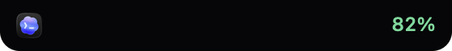
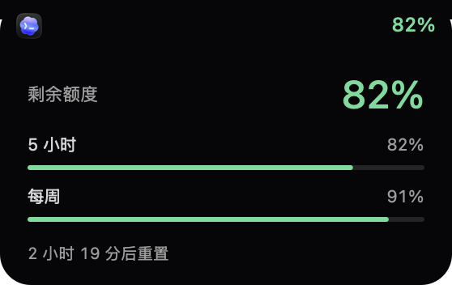

# NotchQuota

[](https://github.com/bcblr1993/NotchQuota/actions/workflows/ci.yml)

一个轻量的 macOS 刘海额度应用。点击原生图标，在已安装的 **Codex / Claude / Antigravity** 之间切换。

- 只显示图标和剩余额度，无操作 **15 秒自动隐藏**；鼠标移到屏幕顶部中央唤出。
- 悬停或点击数字查看各周期的额度；移开鼠标收起。
- 剩余 **>50% 绿色、20–50% 黄色、<20% 红色**；未知额度显示灰色 `—`。
- 原生 Swift / AppKit，无 Electron、后台浏览器或第三方运行时依赖。
- **Apple Silicon（M 系列），macOS 13 或更高版本**，同时适配刘海屏和普通显示器。
- 读取已经保存的登录，不需要让三个原应用保持运行。每 3 分钟自动刷新；启动、唤醒、图标切换或手动刷新也会尝试查询，同一应用至少间隔 30 秒。

## 轻量过渡与安装识别

显示/隐藏、展开/收起和图标切换使用约 0.2 秒的原生过渡；系统开启“减少动态效果”或低电量模式时立即切换。没有循环动画或逐帧轮询，三枚图标在内存中复用。

只显示本机已安装的 Codex、Claude、Antigravity 桌面应用（ChatGPT 不算 Codex）。只安装一个时点击图标不会切换；都未安装时不显示窗口、图标或额度。安装检测在启动、唤出及每 3 分钟刷新时执行；检测到新安装应用不会自行弹出，移入顶部热点即可显示。应用无需运行，但查询额度仍需已有有效登录。

## 预览

下图为原生界面的演示数据。





## 安装

从 [Releases](https://github.com/bcblr1993/NotchQuota/releases/latest) 下载 `macos-arm64.dmg`，打开后将 **NotchQuota** 拖入 **Applications**，再启动。

正式发布的 DMG 使用 Developer ID 签名并经过 Apple 公证。首次下载后系统仍可能显示正常的“从互联网下载”确认。

需要先在相应软件登录过订阅账号，并有可用的网络连接。macOS 首次询问读取登录钥匙串时，请按需允许。**无需安装 Homebrew、Python、Node 或命令行工具**。Codex 已安装的后台命令行组件仅在它的登录过期时用于续期。

右键刘海区域可刷新、隐藏、下载更新、查看说明或退出。退出后不保留后台进程。需要开机启动时，可在 macOS“系统设置 → 通用 → 登录项”中添加 NotchQuota。

## 数据来源与边界

| 应用 | 登录来源 | 额度来源 |
| --- | --- | --- |
| Codex | 当前用户的 `~/.codex/auth.json`（支持 `CODEX_HOME`） | ChatGPT 订阅额度接口 |
| Claude | Claude 桌面版保存的登录会话 | Claude 当前组织的 usage 接口 |
| Antigravity | Antigravity 2.x 的 macOS 钥匙串 | 从已安装应用解析对应的 Google 额度服务 |

紧凑视图显示已知窗口中**最少的剩余比例**；展开后按周期/模型分别显示。额度更新失败时保留并标记旧数据，不把失败当成 0% 或 100%。

目前适配的是订阅额度，**不包含第三方 API 中转站余额**。仅 Claude Code 使用第三方 API Key 时，无法据此查询 Claude 官方订阅。登录完全失效、网页验证或服务接口变化时，可能需要在原应用重新登录/验证。Antigravity 旧 IDE 版与其他凭据存储格式尚未保证兼容。

这些额度接口并非全部稳定公开 API，首次发布不代表所有账户类型、系统版本和网络环境都已经实机覆盖。兼容问题请使用 [问题模板](https://github.com/bcblr1993/NotchQuota/issues/new/choose) 反馈；不要上传凭据、Cookie 或完整认证文件。

## 开发

需要 Xcode 15+ / Swift 5.9+，macOS。源码以 Swift Package 管理，可直接用 Xcode 打开 `Package.swift`。

```sh
git clone https://github.com/bcblr1993/NotchQuota.git
cd NotchQuota
swift test
./scripts/build-app.sh
open build/NotchQuota.app
```

本地构建默认使用临时签名；这种构建不等同于已经公证的发行版。

```sh
# 仅使用演示数据，绝不读取真实凭据
build/NotchQuota.app/Contents/MacOS/NotchQuota --demo

# 只输出脱敏的额度/连接状态，不输出认证信息
build/NotchQuota.app/Contents/MacOS/NotchQuota --diagnose

# 原生窗口截屏及 15 秒隐藏/热点唤出验证
NOTCHQUOTA_SMOKE_DIR=/path/to/output build/NotchQuota.app/Contents/MacOS/NotchQuota --ui-smoke
```

项目结构、发布方式、隐私边界分别见 [架构](docs/ARCHITECTURE.md)、[发布维护](docs/RELEASING.md)、[隐私](PRIVACY.md)。

## 更新和反馈

应用右键菜单的“下载更新”打开 GitHub Releases，不会静默替换程序。下载新版后退出旧版，再替换 Applications 中的应用；只保留当前选中的图标偏好。

遵循语义化版本，所有用户可见改动记录在 [CHANGELOG](CHANGELOG.md)。修复通过 PR、自动测试和构建检查后发布。欢迎提交 Issue / PR。

## 许可证

项目原创代码采用 [MIT](LICENSE) 许可证。应用图标及相关商标属于各自权利人，详见 [第三方声明](THIRD_PARTY_NOTICES.md)。
